# Team football

## Pré-requis

  - Java 8 ou +
  - Maven
  - Git

## Les technologies utilisées

  - Java
  - Spring Boot
  - JPA / Hibernate / Spring Data
  - H2 database
  - Lombok
  - Spring Doc
  
## Installation du projet

- Pour récupérer le projet du git il suffit d'exécuter la commande `git clone https://github.com/lakbir/Team_football.git` dans votre workspace locale.

## Structure du projet
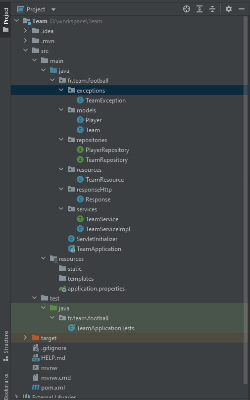

## Démmarage du projet

Après la récupération du projet et pour le démarrer, il suffit de se positionner dans le racine du projet, et dans l'invite de commandes exécuter les commandes maven suivantes dans l'ordre : 
  - `mvn clean`
  - `mvn install`
  - `mvn spring-boot:run`
le projet est démmaré dans le port 8081

## DB

Après le démmarage du projet, vous-pouvez accéder à la base de données utilisée via [ce lien](http://localhost:8081/h2-console/)
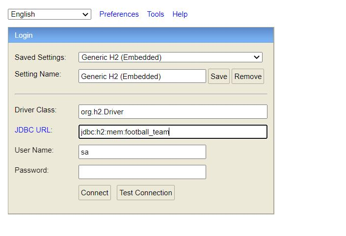

Pour se connecter à la base de données : 
 - Driver Class:	`org.h2.Driver`
 - JDBC URL: `jdbc:h2:mem:football_team`
 - User Name: `sa`
 - Password: ``
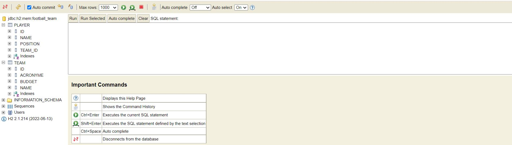

## Documentation API

Pour accéder à l'architucture et la structure d'API ils suffit de cliquer sur [ce lien](http://localhost:8081/v3/api-docs)
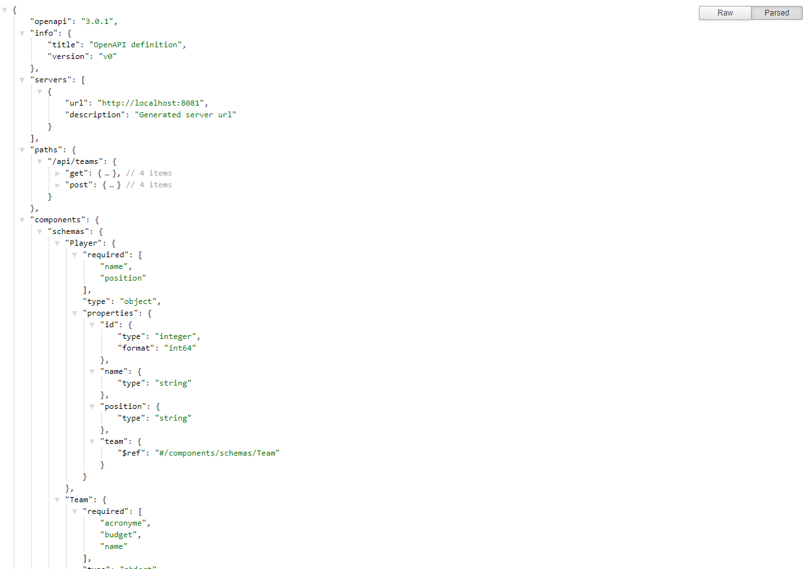

## Documentation & Schémas des méthodes REST

Pour accéder à la documentation et les schémas des méthodes REST via [ce lien](http://localhost:8081/swagger-ui/index.html)
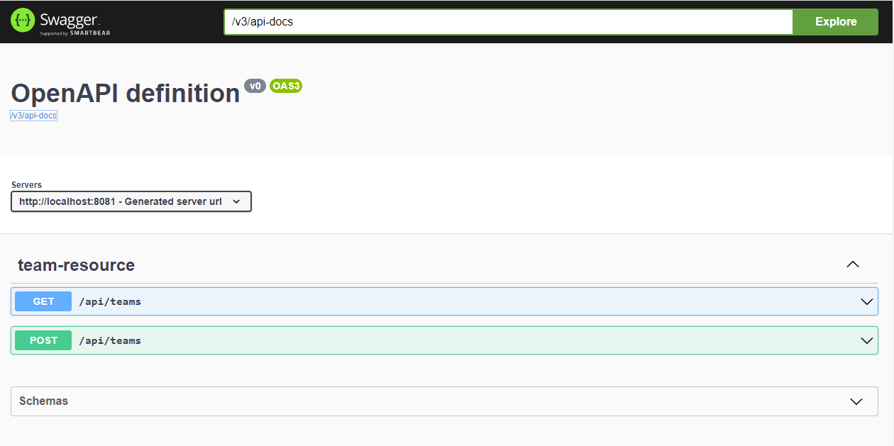

## Test API

Pour tester le fonctionnement de l'API il y a deux méthodes : 

#### Postman : 

###### L'ajout d'une équipe

  - Request :  
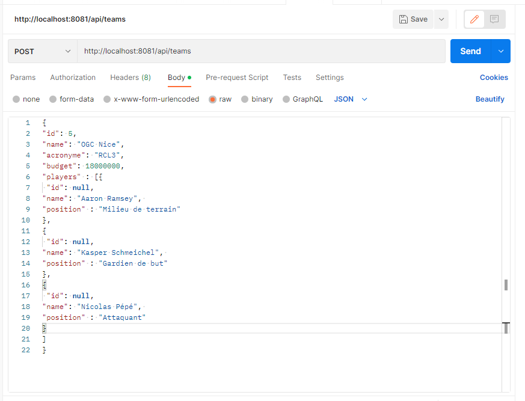

  - Response :  
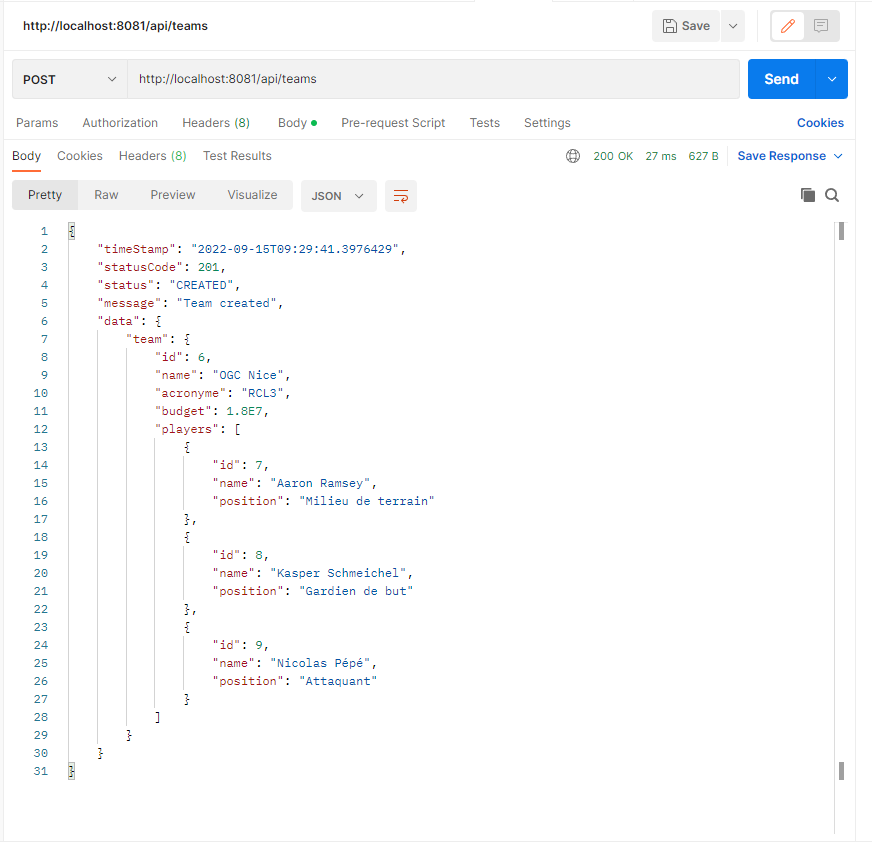

###### Liste d'équipes

  - Request :  
  dans la requête envoyé pour récupérer la liste d'équipes il y a trois paramètres à envoyé facultativement:  
   -`name` : pour faire la recherche par nom d'équipe, par défaut est vide.  
   -`page` : la pagination et pour spécifier la page souhaiter à retourner, par défaut est 0 pour retourner la première page.  
   -`size` : pour spécifier le nombre d'équipes souhaiter retourner par page, par défaut est 10.  
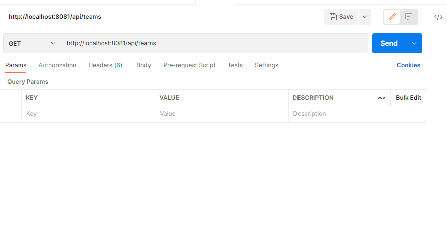

  - Response :  
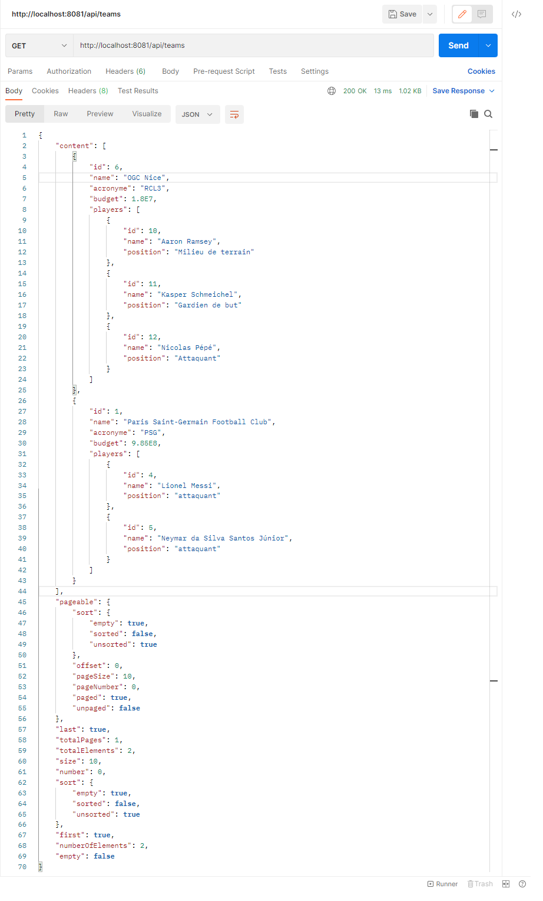

#### Swagger : via [ce lien](http://localhost:8081/swagger-ui/index.html)

###### L'ajout d'une équipe

  - Request :  
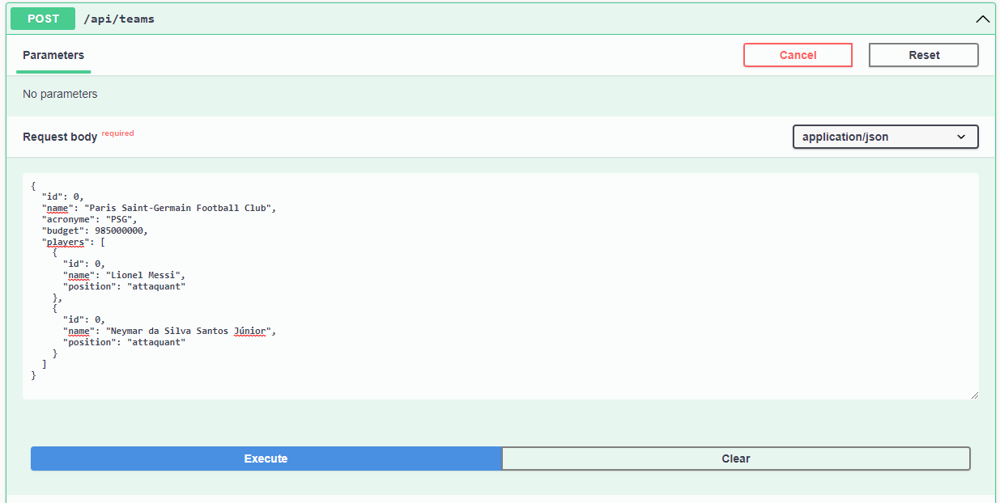

  - Response :  
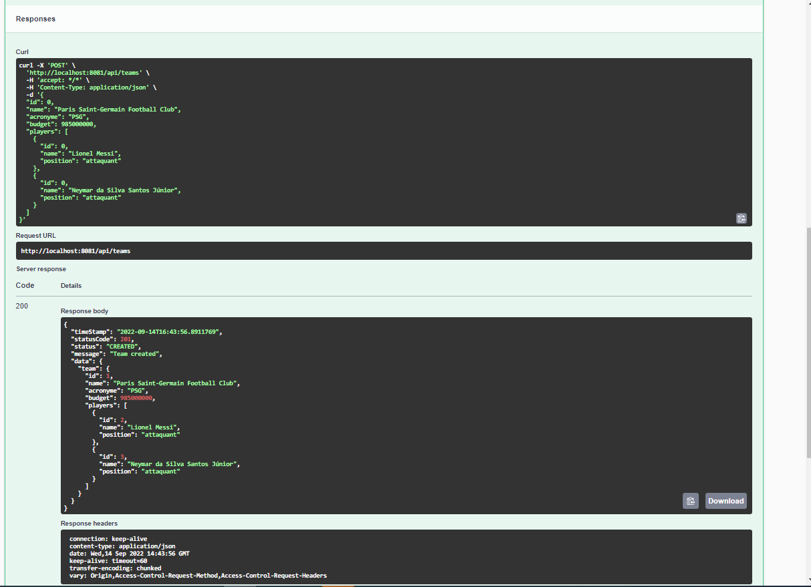

###### Liste d'équipes

  - Request :  
  dans la requête envoyé pour récupérer la liste d'équipes il y a trois paramètres à envoyé facultativement:  
   -`name` : pour faire la recherche par nom d'équipe, par défaut est vide.  
   -`page` : la pagination et pour spécifier la page souhaiter à retourner, par défaut est 0 pour retourner la première page.  
   -`size` : pour spécifier le nombre d'équipes souhaiter retourner par page, par défaut est 10.  
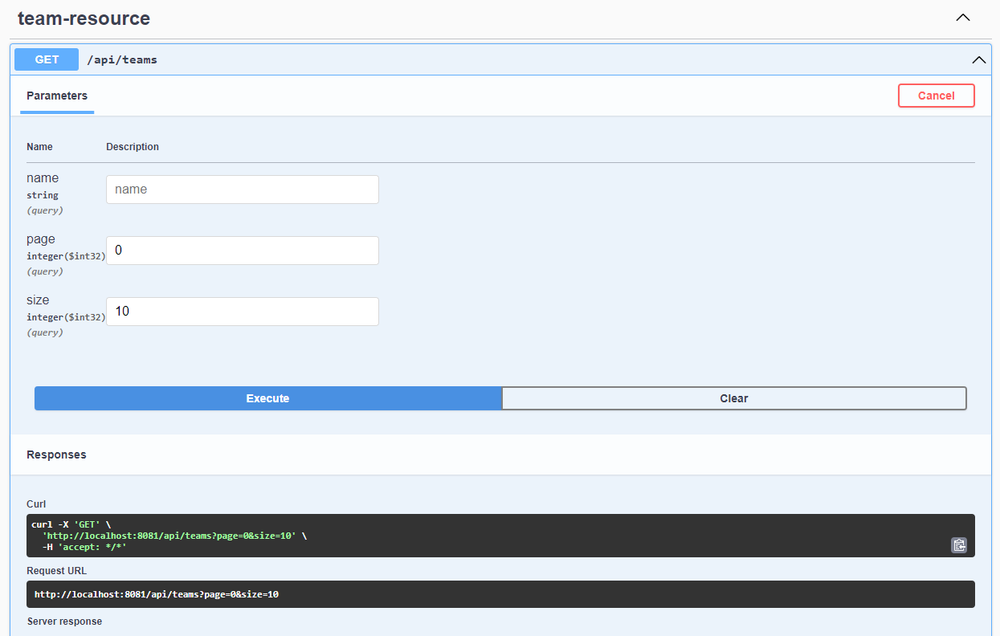

  - Response :  
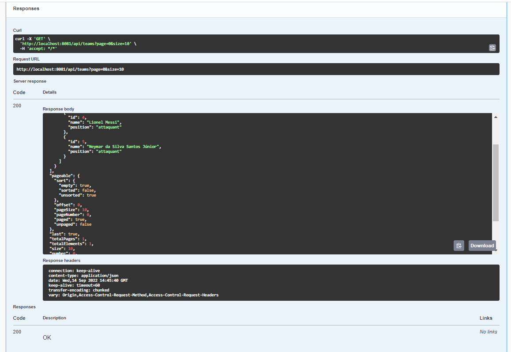

